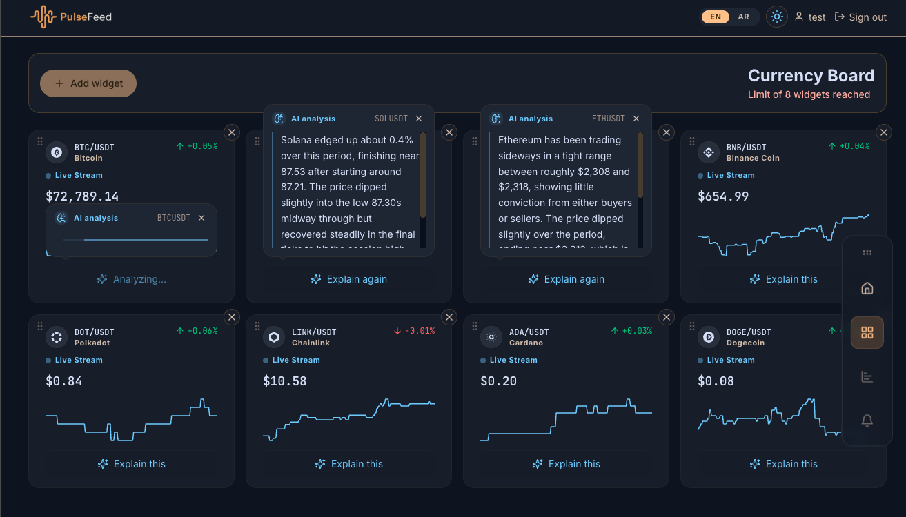
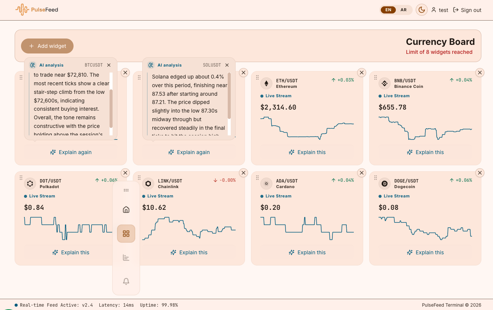
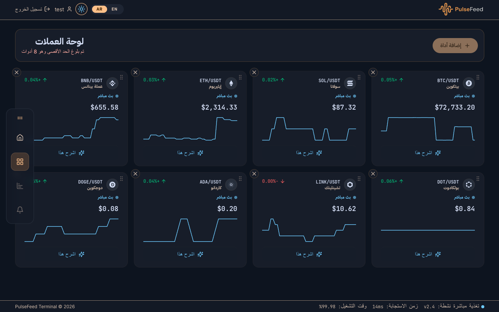
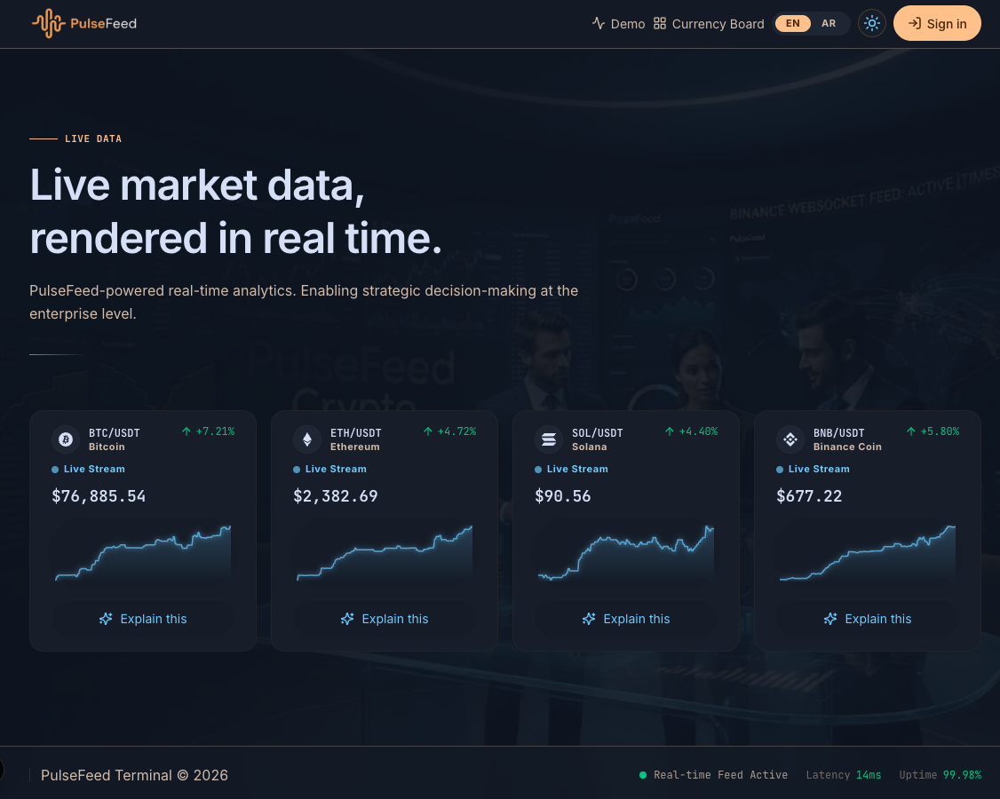
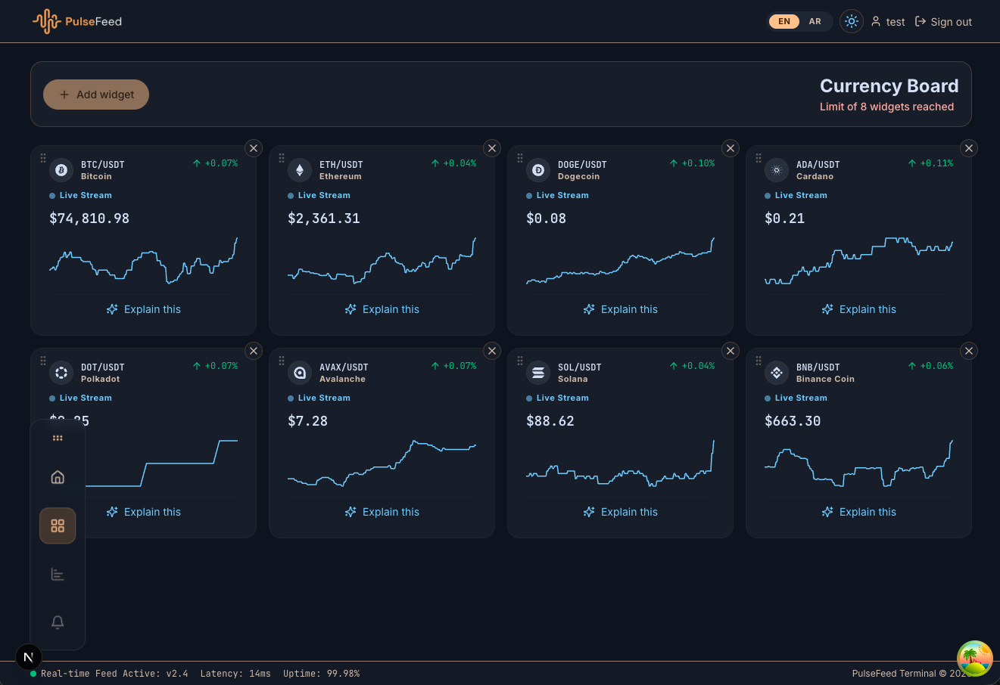
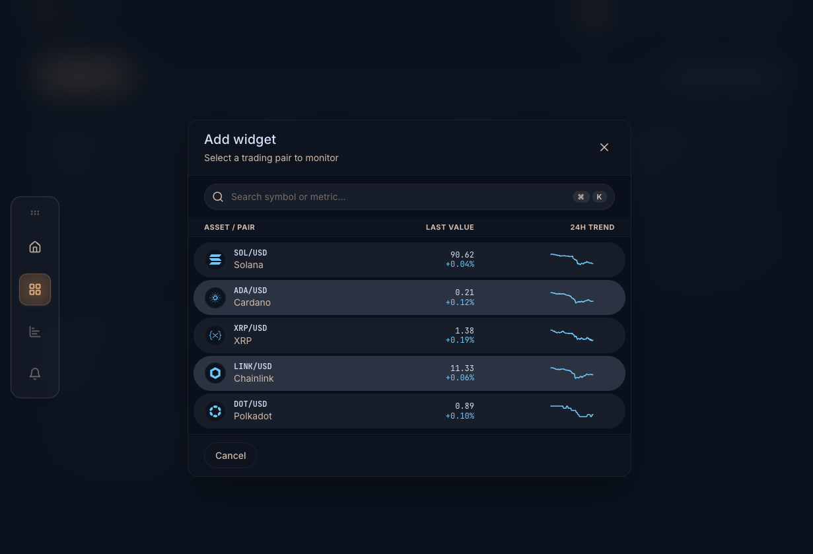

# PulseFeed


Real-time market-data visualization platform. A public demo board streams live crypto prices
over a Binance WebSocket with zero login; signed-in users get a personal, customizable board,
per-widget AI explanations of recent price action, full English/Arabic (RTL) support, and
token-driven dark/light theming.

Built on a deliberately small stack — Next.js on Vercel, PostgreSQL, Better Auth, and
OpenRouter — each dependency chosen for cost-effectiveness at expected scale.

---

## Features

- **Public demo board** — unauthenticated visitors see 4 live-updating widgets
(BTC/USDT, ETH/USDT, SOL/USDT, BNB/USDT) with D3 sparklines, no signup wall.
- **Sign in & personal board** — email/password, GitHub, or Google via Better Auth; a
board pre-populated with the 4 default pairs is auto-created on first login.
- **Sign up** — new user registration with email/password, validation via shared
Zod schemas.
- **Customize & persist** — add, remove, reorder widgets (max 8) via drag handles;
changes persist automatically, reconciled on load.
- **Drag-to-reorder** — visible grip handle on widgets in edit mode with grab/grabbing
cursor affordance.
- **AI-explained price action** — "Explain this" returns a plain-language summary of the
same ~200-tick window the sparkline draws; shared 5-minute cache, graceful
"resets at midnight UTC" state when the daily provider cap is exhausted.
- **Bilingual EN/AR + RTL** — full i18n via i18next, locale-prefixed routing, Arabic
rendered right-to-left; charts stay LTR by deliberate exception.
- **Dark/Light theming** — token-driven design system (CSS custom properties), OS-default
detection, persisted override, no flash-of-wrong-theme.
- **Theme-aware branding** — logo swaps between dark/light variants per active theme.
- **Navigation sidebar** — collapsible sidebar with active-item state, mobile-responsive
hamburger menu; inactive items (market, alerts) are hidden until enabled.
- **Atmospheric background** — subtle background image layer on marketing pages with
theme-aware opacity.
- **Accessible by default** — WCAG 2.1 AA, keyboard-operable, `prefers-reduced-motion`
respected, Lighthouse ≥ 90 gated in CI across both locales and themes.
- **Rate limiting** — per-user token bucket on AI explanation endpoint (30 req/day),
prevents free-tier exhaustion.
- **User preferences** — locale and theme preferences persisted server-side per user.

---

## Screenshots

### Currency Ai Explaination



### Light Theme



### Arabic



### Demo Board



### Customize Board



### Add Widget



### Demo Recording

<video src="public/screenshots/demo-recording.mp4" width="100%" controls></video>

---

## Tech Stack

| Layer     | Choice                                                        |
| --------- | ------------------------------------------------------------- |
| Framework | Next.js 16 (App Router), React 19, TypeScript strict          |
| Styling   | Tailwind CSS + Sass modules, token file (`styles/tokens.css`) |
| Charts    | D3 (sparklines), Recharts (expanded views)                    |
| Forms     | React Hook Form + Zod (shared schemas in `lib/forms/`)        |
| Icons     | react-icons / Lucide (`react-icons/lu`)                       |
| Data      | TanStack Query; native WebSocket → Binance public stream      |
| Auth      | Better Auth (self-hosted) + Prisma adapter                    |
| Database  | PostgreSQL                                                    |
| AI        | OpenRouter (auto-router), 5-min shared cache                  |
| i18n      | i18next + react-i18next, `en`/`ar`                            |
| Theming   | Token-driven CSS custom properties, OS `prefers-color-scheme` |
| Testing   | Vitest, Playwright, Storybook                                 |
| CI        | GitHub Actions + Lighthouse CI                                |

---

## Getting Started

### Prerequisites

- Node.js 20+
- npm
- A PostgreSQL database — pooled connection string

### Environment variables

A committed template lives at `.env.example`. Copy it per environment and fill in real
values — environment files are gitignored and never committed:

```bash
cp .env.example .env.local          # local development
cp .env.example .env.staging        # staging deployment
cp .env.example .env.production     # production deployment
```

Staging and production secrets are injected per environment at deploy time (Vercel project
environments) from the same key set:

```
# PostgreSQL connection string (pooled)
DATABASE_URL="postgresql://..."

# Better Auth
BETTER_AUTH_SECRET="generate-a-long-random-string"
BETTER_AUTH_URL="http://localhost:3000"

# OAuth providers (configure at the provider dashboards)
GITHUB_CLIENT_ID=""
GITHUB_CLIENT_SECRET=""
GOOGLE_CLIENT_ID=""
GOOGLE_CLIENT_SECRET=""

# OpenRouter AI
OPENROUTER_API_KEY=""
OPENROUTER_MODEL="<provider model id>"
```

### Install & run

```bash
npm install

# Apply the database schema
npx prisma migrate dev --name init

# Start the dev server
npm run dev
```

Open [http://localhost:3000](http://localhost:3000) (demo board) and [http://localhost:3000/board](http://localhost:3000/board) (after sign-in).
English and Arabic resolve at `/en` and `/ar`.

---

## Commands

```bash
npm run dev           # dev server
npm run build         # production build
npm start             # serve production build
npm run lint          # ESLint
npm run typecheck     # tsc --noEmit
npm run test:unit     # Vitest unit tests
npx playwright test   # end-to-end tests
npm run storybook     # component browser (design system record)
```

CI runs typecheck → lint → unit tests → Playwright → Lighthouse (fail under 90 on any
category, both locales).

---

## Project Structure

```
pulsefeed/
├── proxy.ts                          # locale detection / redirect
├── next.config.ts                    # security headers, CSP
├── prisma.config.ts                  # Prisma configuration
├── vitest.config.ts                  # Vitest configuration
├── playwright.config.ts              # Playwright configuration
├── lighthouserc.js                   # Lighthouse CI config
├── eslint.config.mjs                 # ESLint flat config
├── postcss.config.mjs                # PostCSS / Tailwind
├── tsconfig.json                     # TypeScript config
│
├── styles/
│   └── tokens.css                    # design tokens: colors, spacing, type
│
├── app/
│   ├── globals.css                   # global styles, animations, utilities
│   ├── manifest.json                 # PWA manifest
│   ├── icon0.svg                     # favicon (SVG)
│   ├── icon1.png                     # favicon (PNG fallback)
│   ├── apple-icon.png                # Apple touch icon
│   ├── [locale]/                     # /en/..., /ar/...
│   │   ├── layout.tsx                # lang/dir, fonts, ThemeProvider + I18nProvider
│   │   ├── (marketing)/             # public routes (no auth required)
│   │   │   ├── layout.tsx            # marketing layout wrapper
│   │   │   ├── page.tsx             # public demo board + hero section
│   │   │   ├── sign-in/page.tsx     # sign-in page
│   │   │   └── sign-up/page.tsx     # sign-up page
│   │   └── (app)/                   # authenticated routes
│   │       └── board/page.tsx       # personal board
│   └── api/
│       ├── auth/[...all]/           # Better Auth catch-all handler
│       ├── boards/
│       │   ├── public/demo/         # demo board data (unauthenticated)
│       │   └── me/
│       │       ├── route.ts         # user's board CRUD
│       │       └── widgets/         # widget add/remove/reorder
│       ├── ai/explain/              # AI explanation endpoint (rate-limited)
│       └── user/locale/             # user locale preference
│
├── lib/
│   ├── prisma.ts                    # Prisma client singleton
│   ├── market-data/                 # Binance provider, tick buffer
│   │   ├── binance-provider.ts      # WebSocket connection to Binance
│   │   ├── provider.ts              # provider interface + factory
│   │   ├── tick-buffer.ts           # ring buffer for recent ticks
│   │   └── types.ts                 # Tick, MarketData types
│   ├── ai-insight/                  # OpenRouter client + cache
│   │   ├── client.ts                # OpenRouter API calls
│   │   ├── cache.ts                 # 5-min shared cache
│   │   └── types.ts                 # AiExplainResult, ExplainGenerator
│   ├── boards/                      # board persistence + ownership
│   │   ├── service.ts               # board CRUD logic
│   │   ├── types.ts                 # BoardDTO, WidgetDTO
│   │   └── errors.ts                # board-specific errors
│   ├── auth/                        # Better Auth config + session
│   │   ├── config.ts                # auth configuration
│   │   ├── session.ts               # server-side session helpers
│   │   └── client.ts                # client-side auth helpers
│   ├── forms/                       # shared RHF/Zod form schemas
│   │   └── schemas.ts               # sign-in, sign-up, widget schemas
│   ├── hooks/                       # shared React hooks
│   │   ├── use-draggable-sidebar.ts # sidebar drag behavior
│   │   └── use-reduced-motion.ts    # motion preference detection
│   ├── ui/                          # shared UI utilities
│   │   └── sidebar-position.ts      # sidebar position persistence
│   ├── user/                        # user preference helpers
│   │   └── locale.ts                # server-side locale persistence
│   ├── rate-limit/                  # rate limiting primitives
│   │   └── token-bucket.ts          # token bucket algorithm
│   └── i18n/                        # locale settings + i18next init
│       ├── settings.ts              # supported locales, dir mapping
│       ├── server.ts                # server-side dictionary loader
│       ├── config.ts                # i18next configuration
│       ├── detect.ts                # locale detection logic
│       └── page-titles.ts           # per-locale page titles
│
├── locales/
│   ├── en/common.json               # English translations
│   └── ar/common.json               # Arabic translations
│
├── components/
│   ├── providers/                   # context providers
│   │   ├── I18nProvider.tsx         # i18next context
│   │   ├── ThemeProvider.tsx         # theme context + persistence
│   │   └── QueryProvider.tsx         # TanStack Query provider
│   ├── brand/
│   │   └── Logo.tsx                 # theme-aware logo (dark/light swap)
│   ├── nav/
│   │   ├── Nav.tsx                  # top navigation bar
│   │   ├── ThemeToggle.tsx          # dark/light toggle button
│   │   └── LanguageSwitcher.tsx     # EN/AR locale switch
│   ├── board/
│   │   ├── Board.tsx                # board container (server component)
│   │   ├── BoardClient.tsx          # board client-side logic
│   │   ├── BoardGrid.tsx            # responsive widget grid
│   │   ├── BoardHeader.tsx          # board header with mobile menu
│   │   ├── BoardSidebar.tsx         # collapsible sidebar navigation
│   │   ├── BoardFooter.tsx          # board footer with status indicators
│   │   ├── AddWidgetModal.tsx       # modal for adding new widgets
│   │   └── nav-items.ts             # sidebar nav item definitions
│   └── widget/
│       ├── Widget.tsx               # widget card (sparkline + controls)
│       ├── Sparkline.tsx            # D3 sparkline chart
│       ├── ExplainButton.tsx        # AI explanation trigger
│       └── CoinIcon.tsx             # cryptocurrency icon component
│
├── prisma/
│   ├── schema.prisma                # database schema
│   └── migrations/                  # migration history
│
├── tests/
│   └── e2e/                         # Playwright end-to-end specs
│       ├── demo-board.spec.ts
│       ├── signin-personal-board.spec.ts
│       ├── signup.spec.ts
│       ├── customize-board.spec.ts
│       ├── ai-explain.spec.ts
│       ├── i18n-rtl.spec.ts
│       ├── a11y.spec.ts
│       └── sidebar-drag.spec.ts
│
├── .storybook/
│   ├── main.ts                      # Storybook configuration
│   └── preview.tsx                  # Storybook preview decorators
│
├── .github/
│   └── workflows/                   # CI/CD pipelines
│
├── public/
│   ├── logo-dark.png                # brand logo (dark theme)
│   ├── logo-light.png               # brand logo (light theme)
│   ├── bg-01.png                    # atmospheric background image
│   ├── og.png                       # OpenGraph social preview
│   ├── robots.txt                   # search engine directives
│   ├── web-app-manifest-192x192.png # PWA icon (small)
│   ├── web-app-manifest-512x512.png # PWA icon (large)
│   └── screenshots/                 # app screenshots and demo recording
│       ├── demo-board.png           # public demo board view
│       ├── sign-in.png              # sign-in page
│       ├── sign-up.png              # sign-up page
│       ├── personal-board.png       # authenticated personal board
│       ├── customize-board.png      # board customization view
│       ├── add-widget.png           # add-widget modal view
│       └── demo-recording.mov       # full app demo video
│
├── DESIGN.md                        # design system documentation
├── .env.example                     # environment variable template
├── lighthouserc.js                  # Lighthouse CI thresholds
└── vitest.config.ts                 # unit test configuration
```

---

## Architecture notes

- **Library-first:** market data, AI insight, boards, and auth are isolated modules under
`lib/`; routes and components call them, never implementing logic inline. The Binance
provider can be swapped without touching UI code.
- **Test-first:** every module ships its failing unit test before implementation; every user
story has a Playwright spec. TDD is a hard gate, not a convention.
- **Server-side authority:** every mutation re-derives the acting user from the Better Auth
session — client-supplied identity is never trusted.
- **One source of truth for design:** every color/spacing/type value comes from
`styles/tokens.css`; components are not complete until verified in both themes and both
locales.
- **Route groups:** `(marketing)` holds public pages (demo, sign-in, sign-up); `(app)`
holds authenticated pages (personal board). Layout nesting keeps concerns separated.
- **Rate limiting:** token bucket algorithm in `lib/rate-limit/token-bucket.ts` protects
the AI explanation endpoint from free-tier exhaustion (30 req/user/day).

---

## Created by

© AHMED SALAH

---

## License

[MIT](LICENSE)
